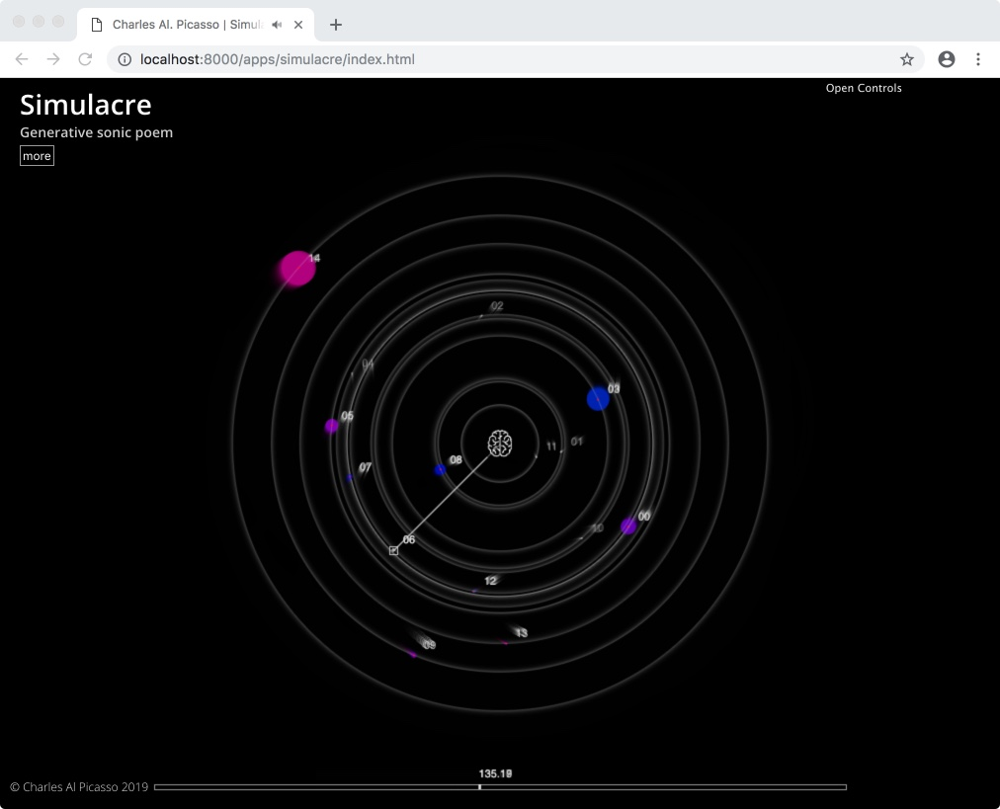

# simulacre

Sonic automata using binaural rendering (WebAudio or Google Resonance).

## Synopsis

**Simulacre** is a sonic automata, where awkward tiny machines (sounds, textures, whispering and ghosly voices) are disposed pseudo-randomely around a listener, move and oscillate mecanically around, enveloping him, giving the feeling they're trying to communicate.
      
## Implementation

The movement of the sound is simply mapped to the visual position in the 2d space. Playing state, intensity amplitude, and also the elevation are mapped to the graphical representation of the sound object.
Depending on your configuration the sounds may be spatialised using the [Google Resonance Audio SDK](https://resonance-audio.github.io/resonance-audio/) (using a 3rd order ambisonic + binaural renderer) or using the standard WebAudio HRTF PannelNode (still binaural).

The Visualisation was made with the [P5js](https://p5js.org) library 

## Browser Support
It was only tested on a Mac. 

1. Chrome uses the Google resonance SDK version. 
2. Firefox and Safari uses the standard Webaudio library (bugs with resonance sdk).
3. Cannot say for other browsers.

Use headphones as it does use binaural rendering.